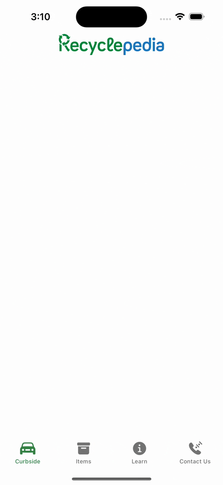

# Hi, I'm Alex

I'm an aspiring developer and an undergraduate student that designs and builds tools using Swift.

---

## Projects

### Recyclepedia

* Utilized SwiftUl and an MVVM architecture with the networking layer implementation backed by Firebase.
* Lead and coordinated the application development with other student-developers and non-technical staff from the nonprofit organization Dream in Green as a part of the UPE SparkDev student organization.
* Provided recycling education for the community and allowed users to find nearby recycling centers using CoreLocation and Mapkit.
